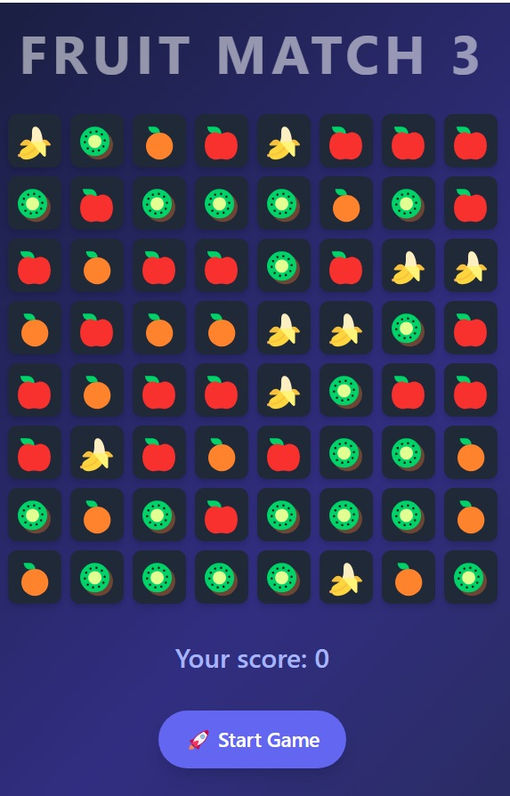

## Fruit Match3 browser game based on GO + Websocket + Alpine.js

[Try it here](https://match3.tyyrok.online) — a simple Match3 game where the main goal is to earn the highest number of scores!

One day I designed and implemented match3 game backend API for commercial uses on Python, and now I'm very interested in GO, so I decided to implement simple version with this beatiful language. So enjoy or maybe use it for your own projects)

### Repository Includes:
- Go backend service
- docker-compose.yml for local deployment
- Startup shell script
- Environment variable template (.env.template)

### Setup Instructions and Usage Instructions
1. Database Setup. Use PostgreSQL — either a local instance or Supabase as a hosted option.
2. Copy .env.template to .env and fill in the required values.
3. Start service by `./start.sh` or `docker-compose up --build -d`

### Screenshots

